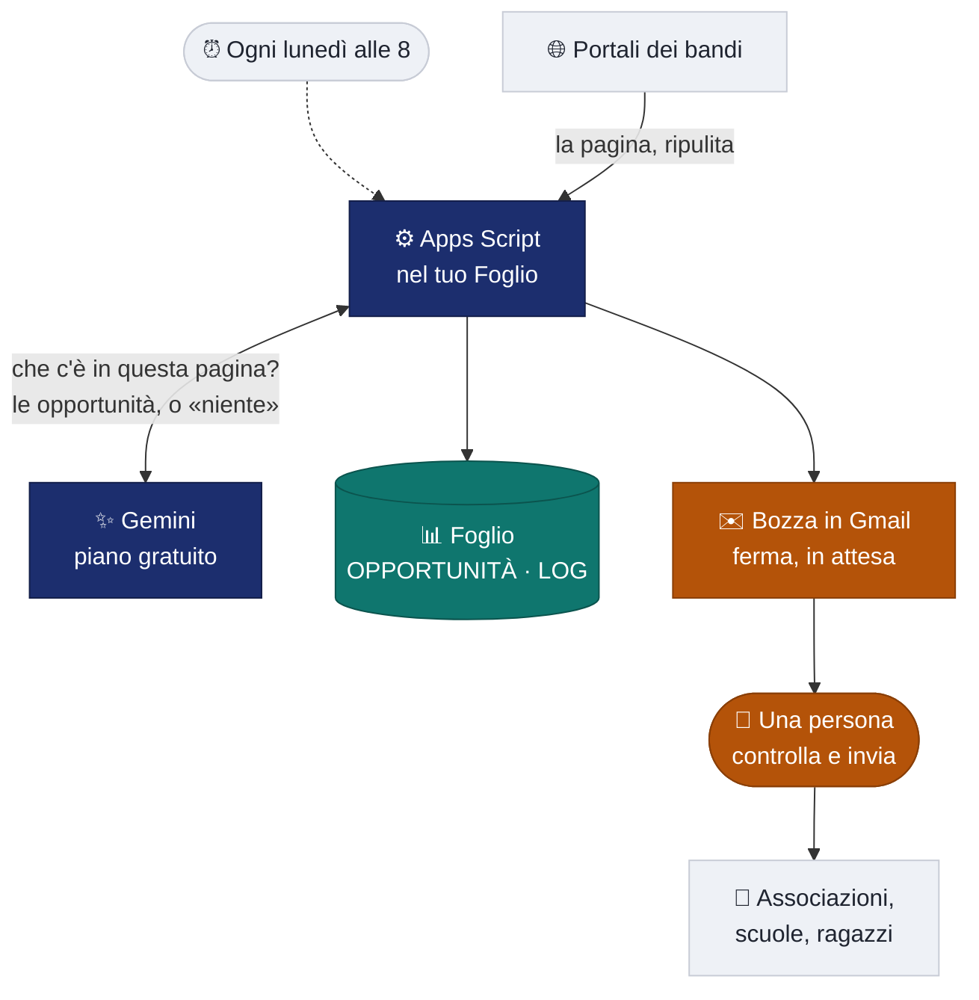

# Radar delle opportunità

**Un Foglio Google che ogni lunedì legge i portali dei bandi, tiene solo ciò che riguarda i giovani
del territorio e prepara all'ufficio una bozza di riepilogo da approvare.**

Nessun server. Nessun abbonamento. Nessun dato personale.
Si installa in dieci minuti e resta di chi lo installa.

Nato come laboratorio pubblico della giornata **«Cittadinanza digitale e intelligenza artificiale»** 
Certosa di Padula, 1 agosto 2026 · progetto **PARTECIPA — Giovani Campania** 
Università degli Studi di Salerno (DISUFF / DiSoSW Lab) · Regione Campania

---

## Il problema

Le opportunità per i ragazzi ci sono — bandi, borse, servizio civile, mobilità europea — ma stanno
sparse su dieci portali, scritte in burocratese, e scadono mentre nessuno le legge. Un ufficio
piccolo non ha una persona che ogni lunedì mattina apre dieci siti.

Il radar fa quella cosa lì, e solo quella.

Tutto quello che è arancione richiede **una persona**: è il punto del progetto, non un dettaglio.

## Che cosa **non** fa — ed è la parte importante

|  | |
|---|---|
| **Non decide** | Propone righe; lo stato «da verificare» lo cambia una persona. |
| **Non invia da solo** | Prepara una bozza. L'invio è un gesto umano, ogni volta. |
| **Non garantisce le scadenze** | Ogni riga porta il link: si controlla alla fonte, sempre. |
| **Non inventa** | Se un dato non è scritto nella pagina, la casella resta **vuota**. Una casella vuota si nota; una data sbagliata no. |
| **Non tratta dati personali** | Nel foglio nessuna colonna con dati di persone: gli unici indirizzi sono i destinatari, scelti dall'ufficio. |
| **Non vede ciò che non gli hai dato** | Se una fonte manca, per il radar non esiste. |

## Installarlo — 10 minuti, una volta sola

> **Servono:** un account Google e una chiave gratuita di Gemini
> ([aistudio.google.com/apikey](https://aistudio.google.com/apikey) — nessuna carta di credito).

**Il modo veloce**

1. [**Crea la tua copia del foglio**](https://docs.google.com/spreadsheets/d/1z-kzfEI8kjuBTVfTvzrhK9gaJGwJwdG3q7CCyyxl_6E/copy) → finisce sul tuo Drive, con il codice già dentro. Salta al punto **5**.

**Il modo da zero**

2. Crea un Foglio vuoto su [sheets.new](https://sheets.new) e chiamalo `Radar opportunità`.
3. **Estensioni → Apps Script**: svuota `Codice.gs` e incolla [`installazione-rapida/Codice.gs`](installazione-rapida/Codice.gs).
4. **+ → HTML**, nome esatto `Pannello`, incolla [`installazione-rapida/Pannello.html`](installazione-rapida/Pannello.html). Salva.

**Comune a entrambi**

5. Torna sul foglio e **ricaricalo**: compare il menu **🛰️ Radar**.
6. **Radar → Prepara il foglio**. La prima volta Google chiede l'autorizzazione: *Avanzate → Apri… (non sicura)*. È il tuo codice, nel tuo account.
7. **Radar → Impostazioni…**: incolla la chiave, premi **Prova la chiave**, scegli il modello dalla tendina, **Salva**.
8. Nel foglio `FONTI`: i portali da sorvegliare (colonna C = `sì`) e almeno un indirizzo email nella **colonna E**.
9. **Radar → Esegui adesso**. Le righe compaiono in `OPPORTUNITÀ`; il riepilogo resta **nelle bozze di Gmail**.
10. **Radar → Accendi la sveglia settimanale**. Da qui in poi va da solo.

Se qualcosa non torna: **Radar → Diagnostica** dice a che punto si è rotto.

> 📘 **Guida passo-passo (IT/EN)** — gli stessi passi raccontati per esteso, con le schermate che
> vedrai, gli errori tipici e le spunte per non perdere il segno, insieme al video del laboratorio:
> sta sul sito del progetto, nella pagina del laboratorio della Certosa di Padula —
> [partecipagiovanicampania.it](https://partecipagiovanicampania.it/evento-1-agosto-2026/).

## Le fonti: quali funzionano, e perché quasi tutte no

Il radar legge l'HTML **così com'è**: non esegue JavaScript. Questo esclude gran parte dei portali
della pubblica amministrazione, che l'elenco dei bandi lo costruiscono nel browser — per il radar
quelle pagine sono vuote. Due regole, imparate provando: **mai le home** (servono le pagine di
*elenco avvisi*) e **provare prima di fidarsi**.

**Verificate il 2 agosto 2026** ✓

| Fonte | Indirizzo | Esito della prova |
|---|---|---|
| Giovani2030 — bandi | `giovani2030.it/bandi-e-opportunita/` | **8 opportunità** con scadenze reali |
| Politiche Giovanili — avvisi | `politichegiovanili.gov.it/comunicazione/avvisi-e-bandi/` | 1 bando, scadenza corretta |
| Agenzia Italiana per la Gioventù | `agenziagiovani.it` | **8** fra corsi e call Erasmus+/ESC |
| Eurodesk Italy — notizie | `eurodesk.it/notizie` | 8 voci |
| Cliclavoro | `cliclavoro.gov.it` | risponde bene |

**Da evitare** ✗ — `bandi.sviluppocampania.it` (richiede JavaScript), `portale-giovani.regione.campania.it`
(solo menu), e in generale le **home**. La fonte più utile di tutte resta **la pagina avvisi del
proprio Comune**: è quella che nessun portale nazionale contiene, ed è il motivo per cui questo
strumento ha senso in un ufficio.

## Adattarlo senza programmare

Tutto dal pannello **Impostazioni**, senza toccare il codice:

| Voglio… | Dove |
|---|---|
| cambiare la fascia d'età | *A chi guardiamo* |
| restringere a un territorio | *Regole aggiuntive* → «tieni solo ciò che riguarda il Vallo di Diano» |
| cambiare giorno e ora del giro | *Quando si sveglia* → poi *Accendi la sveglia* |
| spendere meno | abbassa il *tetto di chiamate* e *quanto testo leggere* |
| far partire le mail da sole | *Il riepilogo parte da solo?* — spento di default |
| provare senza rete | avanzate → *Modalità dimostrativa* |
| aggiungere fonti o destinatari | righe e colonna E del foglio `FONTI` |

## Quanto consuma

Il piano gratuito di Gemini non si paga, ma si esaurisce. Il radar ci sta dentro con ampio margine
grazie a **tre risparmi fatti prima di spendere una chiamata**:

1. le pagine troppo corte o senza una sola parola da bando non arrivano al modello;
2. le pagine **identiche** al giro precedente nemmeno — è il risparmio più grosso: un portale
   pubblica ogni due settimane, il radar passa ogni lunedì;
3. un tetto duro di chiamate per giro: quando si raggiunge, il giro si chiude ordinatamente e le
   fonti rimaste si leggeranno la volta dopo.

Con 4–6 fonti si sta stabilmente **sotto le 5 chiamate a settimana**.

## Com'è fatto

| File | Che cosa fa |
|---|---|
| [`apps-script/00-Configurazione.gs`](apps-script/00-Configurazione.gs) | i valori di partenza, la chiave, i destinatari |
| [`apps-script/01-Fonti.gs`](apps-script/01-Fonti.gs) | legge le fonti, scarica le pagine, i due filtri gratuiti |
| [`apps-script/02-Gemini.gs`](apps-script/02-Gemini.gs) | il prompt, lo schema, i ritentativi, le scadenze passate |
| [`apps-script/03-Foglio.gs`](apps-script/03-Foglio.gs) | scrive le righe e il registro |
| [`apps-script/04-Radar.gs`](apps-script/04-Radar.gs) | il giro, la bozza, l'invio, la sveglia |
| [`apps-script/05-Menu.gs`](apps-script/05-Menu.gs) | il menu «🛰️ Radar» |
| [`apps-script/06-Preparazione.gs`](apps-script/06-Preparazione.gs) | crea i tre fogli, la diagnostica |
| [`apps-script/Pannello.html`](apps-script/Pannello.html) | il pannello delle impostazioni |
| [`installazione-rapida/`](installazione-rapida/) | gli stessi file impacchettati in due, per l'installazione |
| [`foglio-esempio/`](foglio-esempio/) | il foglio `.xlsx` già intestato, e lo script che lo genera |

I sette file sono divisi per **come le cose accadono** — configurazione, fonti, modello, foglio,
giro, menu, preparazione — e sono commentati per essere letti da chi programma poco: nascono da un
laboratorio, e il codice è parte di ciò che si insegna. Dopo ogni modifica,
`node installazione-rapida/unisci.mjs` rigenera il pacchetto in due file.

## Contribuire

Le cose più utili che puoi mandare:

- **fonti che funzionano** — pagine di elenco avvisi che rispondono senza JavaScript, soprattutto comunali;
- **regole di prompt** che hanno corretto un errore vero che hai visto;
- **i casi in cui ha sbagliato** — valgono più di tutto: il registro `LOG` di un radar acceso da
  mesi è un dato raro su quanto sono affidabili questi strumenti dentro un ufficio pubblico.

## Licenza

[MIT](LICENSE) — usalo, modificalo, mettilo nel tuo Comune. Se ti è servito, dillo: fa piacere, e
aiuta il progetto.

---

**[Logika.studio](https://logikastudio.it)** — ideazione, sviluppo e manutenzione · partner tecnico

Progetto **PARTECIPA — Giovani Campania** · Università degli Studi di Salerno, Dipartimento DISUFF / DiSoSW Lab 
Regione Campania · CUP D43C25000560002 · [partecipagiovanicampania.it](https://partecipagiovanicampania.it)

